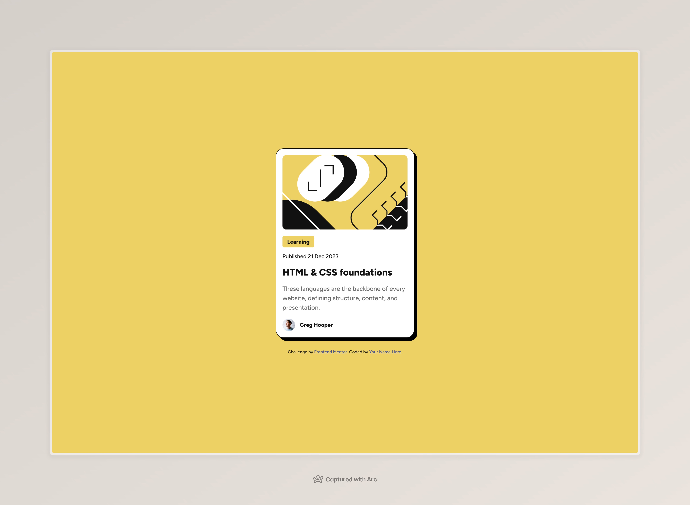

# Frontend Mentor - Blog preview card solution

This is a solution to the [Blog preview card challenge on Frontend Mentor](https://www.frontendmentor.io/challenges/blog-preview-card-ckPaj01IcS). Frontend Mentor challenges help you improve your coding skills by building realistic projects.

## Table of contents

- [Overview](#overview)
  - [The challenge](#the-challenge)
  - [Screenshot](#screenshot)
  - [Links](#links)
- [My process](#my-process)
  - [Built with](#built-with)
  - [What I learned](#what-i-learned)
- [Author](#author)

## Overview

### The challenge

Users should be able to:

- See hover and focus states for all interactive elements on the page

### Screenshot



### Links

- Solution URL: [Github](https://github.com/jcgoodwin86/frontend-mentor-blog-preview-card)
- Live Site URL: [Site](https://kaleidoscopic-yeot-bac921.netlify.app/)

## My process

### Built with

- Semantic HTML5 markup
- CSS custom properties
- Flexbox
- CSS Grid

### What I learned

I didn't need a media query for the card to make it responsive.

```css
.card {
  width: calc(
    100% - 32px
  ); /* Leaves 16px space for the left and right side on smaller screens */
  max-width: 384px; /* Stops it from growing on large screens */
  margin: 0 auto; /* centers it when it starts shrinking */
}
```

## Author

- Website - [Joe Goodwin](https://www.jcgoodwin.com)
- Frontend Mentor - [@jcgoodwin86](https://www.frontendmentor.io/profile/jcgoodwin86)
